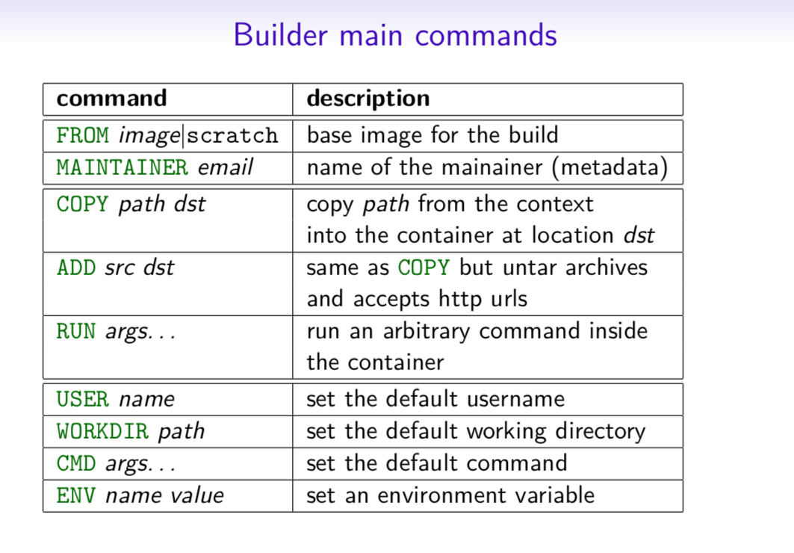
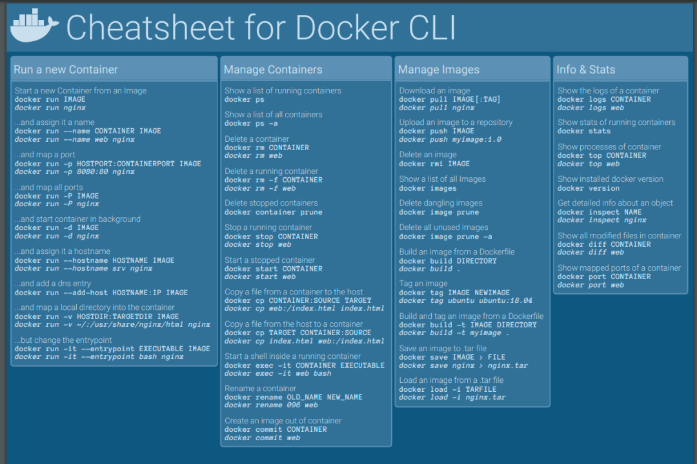

# MLOPS-challenge

1. Train model and track experiments (train_model_template.ipynb)
    - Choose a simple ML model - Load, train, test, save
    - Set MLFlow and run at least 2 experiments with this models and track with dagshub
4. Create a handler file to make inferences using FastAPI (server.py)
5. Test your model inferences in localhost (API_test.ipynb)
5. Create a docker file (Dockerfile)
6. Build and run docker image
7. Test your model inferences on the API running inside the container (API_test.ipynb)
8. Create a virtual machine on aws or google cloud
9. Clone your repo and run docker inside the virtual machine
10. Run inferences through your public vm endpoint (API_test.ipynb)
11. [Optional] Monitor the traffic using Grafana and Prometheus  

To solve this challenge, create a new branch or do a fork of this repo.

## Supplementary material

In the root of the project there are two auxiliary files to help solve the first steps of the challenge and a folder with the example of a simple api to encapsulate in the container, they are: train_model_template.ipynb, API_test.ipynb, API_example.

## MLFlow

The following article provide a simple guide to use mlflow and dagshub:
[MLFlow-Dagshub simple guide](https://towardsdatascience.com/complete-guide-to-experiment-tracking-with-mlflow-and-dagshub-a0439479e0b9)

## Docker

documentaçào
imagem com códigos
### Create Dockerfile

### Docker build

The docker build command builds Docker images from a Dockerfile and a "context". A build's context is the set of files located in the specified PATH or URL.
'''docker build [OPTIONS] PATH'''

Main OPTIONS:
- -t or --tag: This option allows you to assign a tag to the built image for easy referencing and versioning. Common pattern: name_app:version
- --no-cache: This option can be used to force Docker to ignore the cached layers and perform a fresh build.
- --quiet or -q: The --quiet option suppresses the build output, displaying only the final image ID after the image has been built successfully.

Example: docker build -t mlapp:latest --no-cache --quiet .

### Docker run

The docker run command runs a command in a new container, pulling the image if needed and starting the container.

- -d, --detach: Run container in background and print container ID. Good option to run on server
- -p, --publish: Publish a container's port(s) to the host. Map ports to expose.

Example: docker run -p 80:80 docker_image_name

## Create virtual machine

[Guide to create VM on main clouds](https://medium.com/@masterrajpatel/a-tale-of-creating-cloud-instances-in-aws-gcp-and-azure-515aff559885)

### Important notes for creating the VM:

1. When creating the VM, don't forget to check the inbound rules to accept connections on the ports you are going to expose your container to. By default, leave ports 22 (SSH), 80 (http) and 443 (https) enabled;
2. Check the size of the disk, RAM and processor needed for the VM to support your application. To get an idea of the requirements of your api, you can create containers in docker limiting some resources during tests on your local machine;
3. I suggest using the apt-get package tool, available as standard on ubuntu distros, it is the best known and git will already be installed. You only need to install docker.
